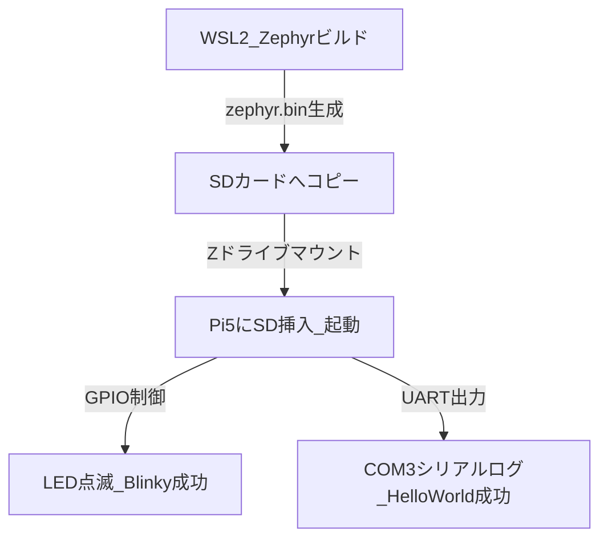

# Raspberry Pi 5 × Zephyr RTOS 開発環境構築 & トラブルシューティングガイド (Tips)

本書は、Windows (WSL2 Ubuntu) 環境において、Raspberry Pi 5 上で Zephyr RTOS を起動し、Lチカおよびシリアルログの出力に成功するまでの手順と、道中で発生した課題の解決策をまとめた開発記録・Tips集です。

---

## 1. 構築環境と達成したゴール

### 開発環境構成
* **ホスト環境**: Windows 11 ➔ WSL2 (Ubuntu 24.04 LTS)
* **ターゲットボード**: Raspberry Pi 5 (Broadcom BCM2712 / Cortex-A76 / ARM64)
* **シリアルデバッガ**: Raspberry Pi Debug Probe (Interface 1: CDC-ACM UART)
* **OS / SDK**:
  * Zephyr RTOS: v4.4.99 (最新開発版 / main)
  * Zephyr SDK: v1.0.0 (aarch64-zephyr-elf ツールチェーン)

### 達成したゴール

1. **環境構築**: 競合のない Python 仮想環境および 64bit ARM クロスコンパイラ（SDK 1.0.0）の導入。
2. **ビルド成功**: `blinky`（Lチカ）および `hello_world` サンプルのコンパイル。
3. **書き込みと実機起動**: WindowsでMBR/FAT32フォーマットしたSDカードから、WSL経由で自動生成された不要なシステムファイルを削除して起動することを確認。
4. **シリアル通信の確立**: Debug Probe 経由で Windows 側の Tera Term に起動ログ（115200bps）を表示。

---

## 2. トラブルシューティング & 開発 Tips

開発中に遭遇した課題と、その具体的な対策・解決理由を以下にまとめます。

### 📌 Python / West 関連

#### ① 仮想環境 (venv) の作成エラーと PEP 668 制限
> ⚠️ **警告 (WARNING)**
> **事象**: `python3 -m venv` 実行時に `ensurepip is not available` で失敗し、システム標準の `pip` は `externally-managed-environment` (PEP 668) でパッケージインストールをブロックされた。
* **原因**: Ubuntu/Debian系OSでは、Python本体と仮想環境モジュールがパッケージで分離されているため。また、システム環境を壊さないよう、システム側pipによる直接インストールが制限されている。
* **対策**: `python3-venv` と `python3-full` を明示的にインストールしてから仮想環境を作り直す。
  ```bash
  sudo apt install python3.14-venv python3-full
  rm -rf ~/zephyr-env
  python3 -m venv ~/zephyr-env
  source ~/zephyr-env/bin/activate
  ```

#### ② `pip install` 中の `hidapi` ビルドエラー
> 💡 **重要 (IMPORTANT)**
> **事象**: `pip install -r requirements.txt` 中に、`hidapi` のビルド段階で `libusb-1.0` が見つからないとしてエラー終了した。
* **原因**: Pythonの `hidapi` は、システムのCライブラリである `libusb` に依存しているため、ビルド時にCヘッダーファイルが必要。
* **対策**: 以下の開発用ライブラリをUbuntuにインストールしてから `pip` を再実行する。
  ```bash
  sudo apt install libusb-1.0-0-dev
  ```

---

### 📌 Zephyr SDK / CMake 関連

#### ③ SDKのバージョン互換性エラー
> 🚫 **注意 (CAUTION)**
> **事象**: `west build` 実行時に `Could not find a configuration file for package "Zephyr-sdk" that is compatible with requested version "1.0"` となり、インストールしていた `0.16.8` が拒絶された。
* **原因**: Zephyr 4.4（最新のmainブランチ）以降では、ツールチェーンが大幅に刷新されたため、**Zephyr SDK 1.0.0 以上が必須** となっている。
* **対策**: `zephyr-sdk-1.0.0` の `minimal` 版をダウンロードし、必要なツールチェーンのみをセットアップする。
  ```bash
  cd ~
  wget https://github.com/zephyrproject-rtos/sdk-ng/releases/download/v1.0.0/zephyr-sdk-1.0.0_linux-x86_64_minimal.tar.xz
  tar xvf zephyr-sdk-1.0.0_linux-x86_64_minimal.tar.xz
  cd zephyr-sdk-1.0.0
  # 必要なアーキテクチャ(aarch64)とホストツールのみをインストールし、CMakeに登録
  ./setup.sh -t aarch64-zephyr-elf -h -c
  ```

---

## 3. 今後の開発に向けたクイックリファレンス

今後、他の Zephyr アプリケーションをビルド・起動する際の最小手順です。

```bash
# 1. 仮想環境のアクティベート
source ~/zephyr-env/bin/activate
cd ~/zephyr-workspace/zephyr

# 2. アプリのビルド (例: hello_world)
west build -p always -b rpi_5 samples/hello_world

# 3. SDカード(Fドライブとする)をマウント
sudo mount -t drvfs F: /mnt/f

# 4. バイナリをコピー
cp build/zephyr/zephyr.bin /mnt/f/

# 5. アンマウントして取り出し
sudo umount /mnt/f
# (Windows側で「安全に取り外す」を実行してPi5へ挿入)
```

この構成を元に開発をスタートしてください！
